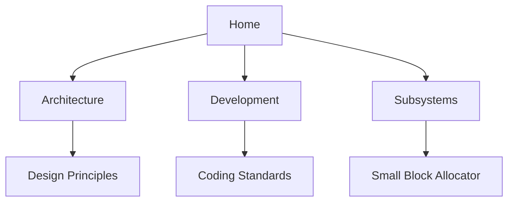

# 🚀 UltraMalloc Wiki Home

Welcome to the official documentation hub for **UltraMalloc** - the high-performance memory allocator designed for modern systems.

## 🌟 Featured Pages

### Core Documentation
| Page | Description |
|------|-------------|
| [📐 Architecture Overview](Architecture.md) | High-level design and components |
| [🧭 Design Principles](Design-Principles.md) | Philosophy and key decisions |
| [📊 Performance Metrics](Performance-Metrics.md) | Benchmark results and analysis |

### For Developers
| Page | Description |
|------|-------------|
| [🛠 Development Setup](Development-Environment.md) | Environment configuration guide |
| [💻 Coding Standards](Coding-Standards.md) | Style guide and best practices |
| [🧪 Testing Guide](Testing-Guide.md) | How to write and run tests |

### Subsystem Deep Dives
| Page | Description |
|------|-------------|
| [🧩 Small Block Allocator](Small-Block-Allocator.md) | Optimizations for ≤256B allocations |
| [🏗 Large Object Heap](Large-Object-Heap.md) | Handling >256B allocations |
| [🔍 Debug Tools](Debug-Tools.md) | Leak detection and visualization |

## 📚 Quick Links
- [Contribution Guide](../CONTRIBUTING.md)
- [Issue Tracker](../../issues)

## 🗺 Navigation Help


## 🆕 Getting Started
1. Read the [Architecture Overview](Architecture.md)
2. Set up your [Development Environment](Development-Environment.md)

---

```bash
# Clone and build to get started
git clone https://github.com/iyoramu/ultramalloc-c.git
cd ultramalloc && mkdir build && cd build
cmake .. && make
```

*Last updated: 04/19/2025*
